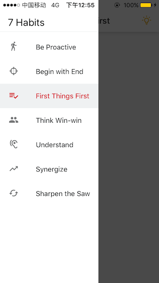

# React navigation example with material style drawer.
In my original project, I would like to implement a app navigator with `StackNavigators` embedded in `DrawerNavigator` using `react-navigation`. Also I need the drawer icon and labed customized. Seems like a very common usecase but spent **quite some time** to achieve it with `react-navigation`.

I would like to further customize the drawer view e.g., have seperate sections for drawer items. Then I realized that I need to fully customize the drawer view. I put a clone of the original implementation here just in case some may need it.

## Screenshot
